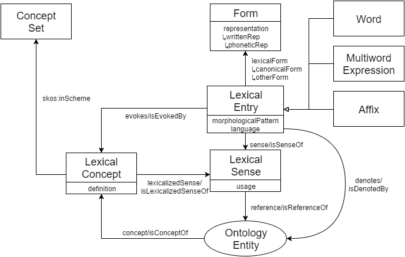
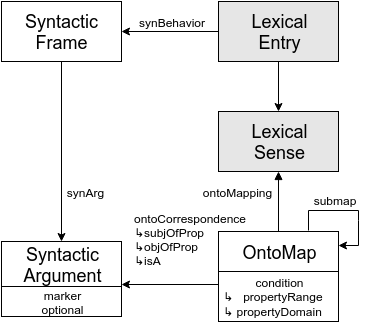
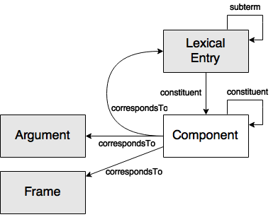
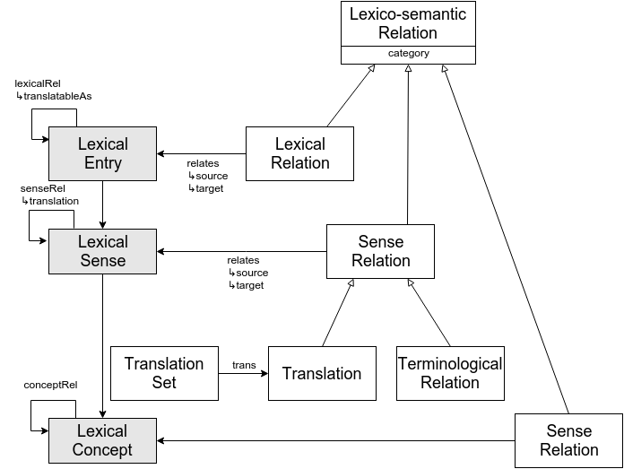

# Notes of Lemon

|时间|内容|
|:---|:---|
|20190408|kick off from WordNet笔记(https://docs.google.com/document/d/1n3fCBNVUPowCkze4ESmllN23lp69xaS8GhPyKB2gU3M/edit). <br/>skimming 5 modules: ontolex, synsem, decomp, vartrans, lime wait on books: 语言学入门, 语言研究|
|20190410|got book: 语言学入门, 语言研究|

## 术语

<!-- 记录阅读过程中出现的关键字及其简单的解释. -->

- Lexicon: n.词典,  专门词汇
- Lexical: adj.词汇的,  具词典性质的，词典的
- linguistic: adj.语言的,  语言学的<br/>
the lexicon model for ontologies (lemon)<br/>
the Ontology Lexicon (Ontolex) community group
- morphological: adj.<生><语>形态学的，形态的
- syntactic: adj.句法的
- grammatical: adj.语法上的，符合语法规则的
- phonetic: adj.语音的,  语音学的,  音形一致的,  表示语音的
- preposition: n.介词,  前置词
- particle: 微粒，颗粒,  [数，物]粒子，质点,  极小量,  小品词<br/>
	In grammar, a particle is a preposition such as 'into' or an adverb such as 'out' which can combine with a verb to form a phrasal verb.
- morpheme: n.形态素，词素
- marker: a free or bound morpheme that indicates the grammatical function of the marked word, phrase, or sentence. <br/>
	https://en.wikipedia.org/wiki/Marker_(linguistics)
- ambiguity: n.含糊,  意义不明确,  含糊的话，模棱两可的话,  可作两种或多种解释


## 介绍

<!-- 描述软件的来源、特性、解决的关键性问题等. -->

### 目标


The aim of lemon is to ==provide rich linguistic grounding for ontologies==. Rich linguistic grounding includes the representation of morphological and syntactic properties of lexical entries as well as the syntax-semantics interface, i.e. the meaning of these lexical entries with respect to an ontology or vocabulary.

丰富的语言学基础: 词汇项的形态学和句法属性、语法-语义接口的表示.


### 报告结构

主要组件:

- Ontology-lexicon interface (ontolex)	本体词汇接口
- Syntax and Semantics (synsem)	语法和语义
- Decomposition (decomp)		分解
- Variation and Translation (vartrans)	变种和翻译
- Linguistic Metadata (lime)		语言元数据

剩余部分:

- how one can add linguistic levels of description by means of external ontologies (section Linguistic Description)?
- how one can use lemon to describe lexical nets and other linguistic resources (section Lexical Nets)?
- the relation between lemon and the Simple Knowledge Organization System (SKOS), the Lexical Markup Model (LMF), and the Open Annotation Model (section Relation to Other Models).

### 命名空间

命名空间:

```
http://www.w3.org/ns/lemon/ontolex#
http://www.w3.org/ns/lemon/synsem#
http://www.w3.org/ns/lemon/decomp#
http://www.w3.org/ns/lemon/vartrans#
http://www.w3.org/ns/lemon/lime#

http://www.w3.org/ns/lemon/all
```

前缀:

```
@prefix ontolex: <http://www.w3.org/ns/lemon/ontolex#> .
@prefix synsem: <http://www.w3.org/ns/lemon/synsem#> .
@prefix decomp: <http://www.w3.org/ns/lemon/decomp#> .
@prefix vartrans: <http://www.w3.org/ns/lemon/vartrans#> .
@prefix lime: <http://www.w3.org/ns/lemon/lime#> .

@prefix rdf: <http://www.w3.org/1999/02/22-rdf-syntax-ns#>.
@prefix owl: <http://www.w3.org/2002/07/owl#>.
@prefix xsd: <http://www.w3.org/2001/XMLSchema#>.
@prefix skos: <http://www.w3.org/2004/02/skos#>.
@prefix dbr: <http://dbpedia.org/resource/>.
@prefix dbo: <http://dbpedia.org/ontology/>.
@prefix void: <http://rdfs.org/ns/void#>.
@prefix lexinfo: <http://www.lexinfo.net/ontology/2.0/lexinfo#>.
@prefix semiotics: <http://www.ontologydesignpatterns.org/cp/owl/semiotics.owl#>.
@prefix oils: <http://lemon-model.net/oils#>.
@prefix dct: <http://purl.org/dc/terms/>.
@prefix provo: <http://www.w3.org/ns/prov#>.
```


## 动机

<!-- 描述阅读软件源码的动机, 要达到什么目的等. -->

## 系统结构

<!-- 描述软件的系统结构, 核心和辅助组件的结构; 系统较复杂时细分展示. -->

## 使用

<!-- 记录软件如何使用. -->

## 数据结构和算法

<!-- 描述软件中重要的数据结构和算法, 支撑过程部分的记录. -->


### Ontology-lexicon interface (ontolex)	本体词汇接口



#### Lexical Entries

A **lexical entry** represents a unit of analysis of the lexicon that consists of a set of forms that are grammatically related and a set of base meanings that are associated with all of these forms. Thus, a lexical entry is a word, multiword expression or affix with a single part-of-speech, morphological pattern, etymology and set of senses. - 词汇项

A **word** is a lexical entry that consists of a single token. - 单词

A **multiword** expression is a lexical entry that consists of two or more words. - 多词表达式

An **affix** is a lexical entry that represents a morpheme (suffix, prefix, infix, circumfix) that is attached to a word stem to form a new word. - 词缀

#### Forms

A **form** represents one grammatical realization of a lexical entry. - 形式

The **lexical form** property relates a lexical entry to one grammatical form variant of the lexical entry. - 词汇形式关系

The **canonical form** property relates a lexical entry to its canonical or dictionary form. This usually indicates the "lemma" form of a lexical entry. - 标准形式关系

The **other form** property relates a lexical entry to a non-preferred ("non-lemma") form that realizes the given lexical entry. - 其他形式关系

The **representation** property indicates a string by which the form is represented according to some scheme. - 表示关系

The **written representation** property indicates the written representation of a form. - 书写表示关系

The **phonetic representation** property indicates one phonetic representation of the pronunciation of the form using a scheme such as the International Phonetic Alphabet (IPA). - 语音表示关系

The **morphological pattern** property indicates the morphological class of a word. - 形态模式关系

#### Semantics

The **denotes** property relates a lexical entry to a predicate in a given ontology that represents its meaning and has some denotational or model-theoretic semantics. - 指称或模型理论语义关系

#### Lexical Sense & Reference

A **lexical sense** represents the lexical meaning of a lexical entry when interpreted as referring to the corresponding ontology element. A lexical sense thus represents a reification of a pair of a uniquely determined lexical entry and a uniquely determined ontology entity it refers to. A link between a lexical entry and an ontology entity via a Lexical Sense object implies that the lexical entry can be used to refer to the ontology entity in question. - 词汇含义

The **sense** property relates a lexical entry to one of its lexical senses. - 含义关系

The **reference** property relates a lexical sense to an ontological predicate that represents the denotation of the corresponding lexical entry. - 引用关系

#### Usage

The **usage** property indicates usage conditions or pragmatic implications when using the lexical entry to refer to the given ontological meaning. - 使用关系

#### Lexical Concept

A **lexical concept** represents a mental abstraction, concept or unit of thought that can be lexicalized by a given collection of senses. - 词汇概念

The **evokes** property relates a lexical entry to one of the lexical concepts it evokes, i.e. the mental concept that speakers of a language might associate when hearing the lexical entry. - 唤起关系

The **lexicalized sense** property relates a lexical concept to a corresponding lexical sense that lexicalizes the concept. - 词汇化含义关系

The **concept** property relates an ontological entity to a lexical concept that represents the corresponding meaning. - 概念关系

A **concept set** represents a collection of lexical concepts. - 概念集


### Syntax and Semantics (synsem) 语法和语义



#### Syntactic Frames

A **syntactic frame** represents the syntactic behavior of an open class word in terms of the (syntactic) arguments it requires. It essentially describes the so called subcategorization structure of the word in question, in particular the syntactic arguments it requires. - 句法框架

The **syntactic behavior** property relates a lexical entry to one of its syntactic behaviors as captured by a syntactic frame. - 句法行为关系

A **syntactic argument** represents a slot that needs to be filled for a certain syntactic frame to be complete. Syntactic arguments typically realize a certain grammatical function (e.g. subject, direct object, indirect object, prepositional object, etc.). - 句法参数

The object property **synArg** relates a syntactic frame to one of its syntactic arguments. - 句法参数关系

#### Ontology Mappings

An **ontology mapping** (**OntoMap** for short) specifies how a syntactic frame and its syntactic arguments map to a set of concepts and properties in the ontology that together specify the meaning of the syntactic frame. - 本体映射

The **ontoMapping** property relates an ontology mapping to its corresponding lexical sense. - 本体映射关系

The **ontoCorrespondence** property binds an argument of a predicate defined in the ontology to a syntactic argument that realizes this predicate argument syntactically. - 本体对应关系
The **is a** property represents the single argument of a class or unary predicate. - isA关系

The **subjOfProp** property represents the 1st argument or subject of a binary predicate (property) in the ontology. - 关系主体关系

The **objOfProp** represents the 2nd argument or object of a binary predicate (property) in the ontology. - 关系客体关系

The object property **marker** indicates the marker of a syntactic argument; this can be a case marker or some other lexical entry such as a preposition or particle.

#### Complex ontology mappings / submappings

The **submap** property relates a (complex) ontological mapping to a set of bindings that together bind the arguments of the involved predicates to a set of syntactic arguments that realize them syntactically. - 映射绑定关系

The **optional** property indicates whether a syntactic argument is optional, that is, it can be syntactically omitted. - 可选关系


#### Conditions

The **condition** property defines an evaluable constraint that derives from using a certain lexical entry to express a given ontological predicate. - 条件关系

The **propertyDomain** property specifies a constraint on the type of arguments that can be used at the first position of the property that is referenced by the given sense. - 关系定义域关系

The **propertyRange** property specifies a constraint on the type of arguments that can be used at the first position of the property that is referenced by the given sense. - 关系值域关系


### Decomposition (decomp) 分解



#### Subterms

The property **subterm** relates a compound lexical entry to one of the lexical entries it is composed of. - 子项关系: 复合词汇项 => 构成其的一个词汇项

#### Components

A **component** is a particular realization of a lexical entry that forms part of a compound lexical entry. - 成分

The property **constituent** relates a lexical entry or component to a component that it is constituted by. - 构成关系: 一个词汇项/成分 => 构成其的成分

The property **correspondsTo** links a component to a corresponding lexical entry or argument. - 对应关系: 成分 => 对应的词汇项/参数

#### Phrase structure

The syntactic categories of the phrases are indicated using the property **olia:hasTag** from the OLiA vocabulary using the Penn TreeBank tagset.

http://nachhalt.sfb632.uni-potsdam.de/owl/

https://www.ling.upenn.edu/courses/Fall_2003/ling001/penn_treebank_pos.html

### Variation and Translation (vartrans) 变种和翻译



### Lexico-Semantic Relations

The **lexicalRel** property relates two lexical entries that stand in some lexical relation. - 有词汇关系关系

The **senseRel** property relates two lexical senses that stand in some sense relation. - 有含义关系关系

A **lexico-semantic** relation represents the relation between two lexical entries or lexical senses that are related by some lexical or semantic relationship. - 词汇语义

The **relates** property links a lexico-semantic relation to the two lexical entries or lexical senses between which it establishes the relation. - 关联关系

The **source** property indicates the lexical sense or lexical entry involved in a lexico-semantic relation as a 'source'. - 源关系

The **target** property indicates the lexical sense or lexical entry involved in a lexico-semantic relation as a 'target'. - 目标关系

A **lexical** relation is a lexico-semantic relation that represents the relation between two lexical entries the surface forms of which are related grammatically, stylistically or by some operation motivated by linguistic economy. - 词汇关系

The **category** property indicates the specific type of relation by which two lexical entries or two lexical senses are related. - 类型关系

A **sense** relation is a lexico-semantic relation that represents the relation between two lexical senses the meanings of which are related. - 含义关系

A **terminological** relation is a sense relation that relates two lexical senses of terms that are semantically related in the sense that they can be exchanged in most contexts, but their surface forms are not directly related. The variants vary along dimensions that are not captured by the given ontology and are intentionally (pragmatically) caused. - 术语关系

The **conceptRel** property relates two lexical concepts that stand in some sense relation. - 有含义关系关系

**Conceptual Relation**: A relationship between two lexical concepts - 概念性关系

#### Translation

Translation relates two lexical entries from different languages the meaning of which is 'equivalent'. This 'equivalence' can be expressed at three different levels:

(1) **Ontological Equivalence (Shared reference)**: The simplest case is to have two entries in different languages that denote the same ontology entity. In this case they are clearly translations as they have the same interpretation.<br/>
(2) **Translation**: In these cases, the lexical entries might not denote exactly the same concept, but their lexical meanings (senses) be equivalent in that they can be exchanged for each other in most contexts. Translation in this case is a subclass of sense relation.<br/>
(3) **Translatable as**: In this case, we underspecify the exact involved meanings of the two lexical entries that are said to be translations of each other, essentially specifying that, in some contexts, one lexical entry in a source language can be replaced by an entry in the target language, depending on the senses of these lexical entries in the given context.


A **translation** is a sense relation expressing that two lexical senses corresponding to two lexical entries in different languages can be translated to each other without any major meaning shifts. - 翻译

The **translation** property relates two lexical senses of two lexical entries that stand in a translation relation to one another. - 翻译关系

The **translatableAs** property relates a lexical entry in some language to a lexical entry in another language that it can be translated as depending on the particular context and specific senses of the involved lexical entries. - 可翻译为关系

A **translation set** is a set of translations that have some common source. - 翻译集

The **trans** property relates a TranslationSet to one of its translations. - 属于翻译集关系

### Linguistic Metadata (lime) 语言元数据

the LInguistic MEtadata (lime) module


Following the conceptual model of the lexicon-ontology interface, lime distinguishes three main metadata entities:

(1) the reference dataset (describing the semantics of the domain, e.g., the ontology),<br/>
(2) the lexicon (being a collection of lexical entries),<br/>
(3) the concept set (an optional set of lexical concepts, bearing a conceptual backbone to a lexicon)

Metadata is attached in particular to three types of sets that lime distinguishes:

(1) the set of lexicalizations, containing the bindings between logical predicates in the ontology and lexical entries in the lexicon<br/>
(2) the set of conceptualizations, containing the bindings between lexical concepts in the concept set and entries in the lexicon<br/>
(3) the set of lexical links, linking lexical concepts from a concept set to references in an ontology


#### Lexicon and Lexicon Metadata

A **lexicon** represents a collection of lexical entries for a particular language or domain. - 词汇

The **entry** property relates a lexicon to one of the lexical entries contained in it. - 项关系

The **language** property indicates the language of a lexicon, a lexical entry, a concept set or a lexicalization set. - 语言关系

The **lexical entries** property indicates the number of distinct lexical entries contained in a lexicon, lexicalization set or conceptualization set. - 词汇项关系

The **linguistic catalog** property indicates the catalog of linguistic categories used in a lexicon to define linguistic properties of lexical entries. - 语言学目录关系

#### Lexicalization Set

A **lexicalization** set is a dataset that comprises a collection of lexicalizations, that is pairs of lexical entry and corresponding reference in the associated ontology/vocabulary/dataset. - 词汇化集

The ****reference dataset** property indicates the dataset that contains the domain objects or vocabulary elements that are either referenced by a given lexicon, providing the grounding vocabulary for the meaning of the lexical entries, or linked to lexical concepts in a concept set by means of a lexical link set. - 引用数据集关系

The **lexicon dataset** property indicates the lexicon that contains the entries referred to in a lexicalization set or a conceptualization set. - 词汇数据集关系

The **lexicalization model** property indicates the model used for representing lexical information. Possible values include (but are not limited to) http://www.w3.org/2000/01/rdf-schema# (for the use of rdfs:label), http://www.w3.org/2004/02/skos/core (for the use of skos:pref/alt/hiddenLabel), http://www.w3.org/2008/05/skos-xl (for the use of skosxl:pref/alt/hiddenLabel) and http://www.w3.org/ns/lemon/ontolex for lemon. - 词汇化模型关系

The **references** property indicates the number of distinct ontology or vocabulary elements that are either associated with lexical entries via a lexicalization set or linked to lexical concepts via a lexical link set. - 引用关系

The **lexicalizations** property indicates the total number of lexicalizations in a lexicalization set, that is the number of unique pairs of lexical entry and denoted ontology element. - 词汇化关系

The **average number of lexicalizations** property indicates the average number of lexicalizations per ontology element. - 词汇化平均数量关系

The **percentage** property expresses the percentage of entities in the reference dataset which have at least one lexicalization in a lexicalization set or are linked to a lexical concept in a lexical linkset. - 百分比关系

#### Partitions

The **partition** property relates a lexicalization set or lexical linkset to a logical subset that contains lexicalizations for a given ontological type only. - 分区关系

The **resource type** property indicates the type of ontological entity of a lexicalization set or lexical linkset. - 资源类型关系

#### Lexical Linkset

A **lexical linkset** represents a collection of links between a reference dataset and a set of lexical concepts (e.g. synsets of a wordnet). - 词汇链接集

The **conceptual dataset** property relates a lexical link set or a conceptualization set to a corresponding concept set. - 概念数据集关系

The **concepts** property indicates the number of lexical concepts defined in a concept set or involved in either a LexicalLinkset or ConceptualizationSet. - 概念关系

The **links** property indicates the number of links between concepts in the concept set and entities in the reference dataset. - 连接数量关系

The **average number of links** property indicates the average number of links to lexical concepts for each ontology element in the reference dataset. - 平均连接数量关系


#### Conceptualization Set

A **conceptualization set** represents a collection of links between lexical entries in a lexicon and lexical concepts in a concept set they evoke. - 概念化集

The **conceptualizations** property indicates the number of distinct conceptualizations in a conceptualization set. - 概念化关系

The **average ambiguity** property indicates the average number of lexical concepts evoked by each lemma/canonical form in the lexicon. - 平均唤起数量

The **average synonymy** property indicates the average number of lexical entries evoking each lexical concept in the concept set. - 平均同义数量

#### Formal definition of properties

TODO

#### Publication Scenarios

TODO


## 过程

<!-- 描述软件中重要的过程性内容, 例如服务器的启动、服务器响应客户端请求、服务器背景活动等. -->

## 文献引用

<!-- 记录软件相关和进一步阅读资料: 文献、网页链接等. -->

- Lexicon Model for Ontologies: Community Report, 10 May 2016: https://www.w3.org/2016/05/ontolex/

## 其他备注
