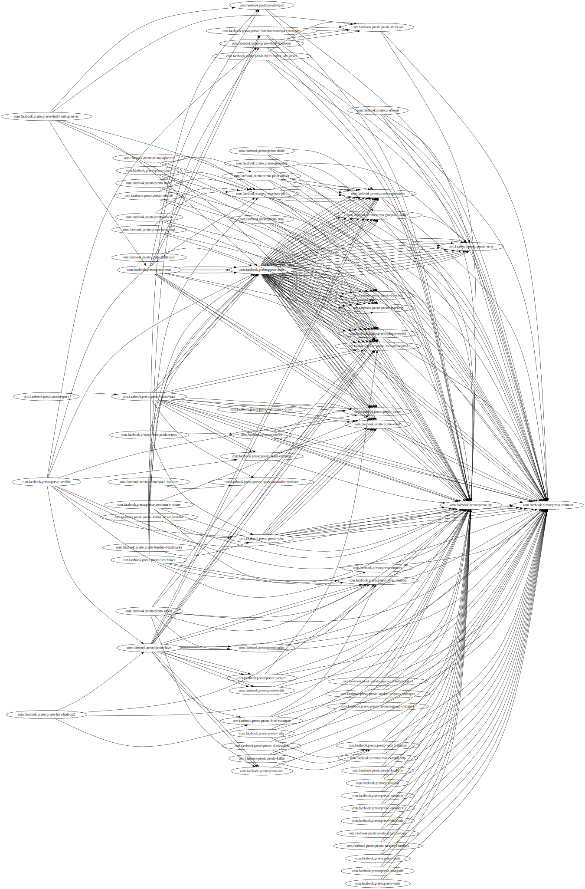

# 源码阅读笔记模板

|时间|内容|
|:---|:---|
|20210414|kick off.|

## 术语

<!-- 记录阅读过程中出现的关键字及其简单的解释. -->

Server Type:

- Coordinator: 负责解析statement, 规划query, 管理worker节点.
- Wroker: 负责执行task和处理数据.

Data Sources:

- Connector: 适配数据源. 每个catalog与一个特定的connector关联.
- Catalog: 包含通过connector的数据源中schema和引用.
- Schema: 组织表的方式.
- Table: 一组未排序的行, 被组织成带类型的命名列.

Query Execution Model:

- Statement: ANSI兼容的SQL语句.
- Query: 执行statement时的配置和实例化的组件.
- Stage: 执行query时, 将执行拆分为stage的层次结构.
- Task: 将stage拆分为任务, 处理split.
- Split: 大数据集的一部分.
- Driver: task包含一个或多个并行的驱动器, 组合operator处理数据并生成输出.
- Operator: 消费/转换/生成数据.
- Exchange: 在一个query的不同stage里在节点间传输数据.

## 介绍

<!-- 描述软件的来源、特性、解决的关键性问题等. -->

## 动机

<!-- 描述阅读软件源码的动机, 要达到什么目的等. -->

## 系统结构

<!-- 描述软件的系统结构, 核心和辅助组件的结构; 系统较复杂时细分展示. -->

|Module|Description|
|:---|:---|
|presto-atop||
|presto-spi|`com.facebook.presto.spi.connector.Connector`|
|presto-array||
|presto-cache||
|presto-jmx||
|presto-record-decoder||
|presto-kafka||
|presto-redis||
|presto-accumulo||
|presto-cassandra||
|presto-blackhole||
|presto-memory||
|presto-orc||
|presto-parquet||
|presto-rcfile||
|presto-hive||
|presto-hive-common||
|presto-hive-hadoop2||
|presto-hive-metastore||
|presto-i18n-functions||
|presto-teradata-functions||
|presto-example-http||
|presto-local-file||
|presto-tpch||
|presto-tpcds||
|presto-raptor||
|presto-base-jdbc||
|presto-testing-docker||
|presto-mysql||
|presto-oracle||
|presto-postgresql||
|presto-redshift||
|presto-sqlserver||
|presto-mongodb||
|presto-bytecode||
|presto-client||
|presto-parser|AST: `com.facebook.presto.sql.tree.Node`<br/>Parser: `com.facebook.presto.sql.parser.SqlParser`|
|presto-main|`com.facebook.presto.server.PrestoServer`<br/>`com.facebook.presto.server.ServerMainModule`<br/>`com.facebook.presto.server.CoordinatorModule`<br/>`com.facebook.presto.server.WorkerModule`|
|presto-ml||
|presto-geospatial||
|presto-geospatial-toolkit||
|presto-benchmark||
|presto-tests||
|presto-product-tests||
|presto-jdbc||
|presto-pinot||
|presto-pinot-toolkit||
|presto-cli|`<main-class>com.facebook.presto.cli.Presto</main-class>`|
|presto-benchmark-driver||
|presto-server|使用Apache Maven Assembly聚合输出归档: launcher, plugin. `<main-class>com.facebook.presto.server.PrestoServer</main-class>`|
|presto-server-rpm||
|presto-docs||
|presto-verifier||
|presto-testing-server-launcher||
|presto-plugin-toolkit||
|presto-resource-group-managers||
|presto-password-authenticators||
|presto-session-property-managers||
|presto-benchto-benchmarks||
|presto-thrift-api||
|presto-thrift-testing-server||
|presto-thrift-connector||
|presto-matching||
|presto-memory-context||
|presto-proxy|`<main-class>com.facebook.presto.proxy.PrestoProxy</main-class>`|
|presto-kudu||
|presto-elasticsearch||
|presto-function-namespace-managers||
|presto-expressions||
|presto-benchmark-runner||
|presto-spark-classloader-interface||
|presto-spark-base||
|presto-spark-common||
|presto-spark||
|presto-spark-package||
|presto-spark-launcher||
|presto-spark-testing||
|presto-druid||
|presto-common||
|presto-thrift-testing-udf-server||
|presto-thrift-spec||




## 使用

<!-- 记录软件如何使用. -->

### Presto Properties References

> We can get some hints about the component behavior on these configuration properties.


####  General Properties

|<div style="width:650px">Property/Description</div>|Type|Allowed Values|Default Value|
|:---|:---|:---|:---|
|join-distribution-type|string|`AUTOMATIC`, `PARTITIONED`, `BROADCAST`|`PARTITIONED`|
|The type of distributed join to use. <br/>When set to `PARTITIONED`, presto will use hash distributed joins. <br/>When set to `BROADCAST`, it will broadcast the right table to all nodes in the cluster that have data from the left table. Partitioned joins require redistributing both tables using a hash of the join key. This can be slower (sometimes substantially) than broadcast joins, but allows much larger joins. In particular broadcast joins will be faster if the right table is much smaller than the left. However, broadcast joins require that the tables on the right side of the join after filtering fit in memory on each node, whereas distributed joins only need to fit in distributed memory across all nodes. <br/>When set to `AUTOMATIC`, Presto will make a cost based decision as to which distribution type is optimal. It will also consider switching the left and right inputs to the join. In `AUTOMATIC` mode, Presto will default to hash distributed joins if no cost could be computed, such as if the tables do not have statistics. This can also be specified on a per-query basis using the join_distribution_type session property.|
|redistribute-writes|boolean||true|
|This property enables redistribution of data before writing. This can eliminate the performance impact of data skew when writing by hashing it across nodes in the cluster. It can be disabled when it is known that the output data set is not skewed in order to avoid the overhead of hashing and redistributing all the data across the network. This can also be specified on a per-query basis using the redistribute_writes session property.|

####  Memory Management Properties

|<div style="width:650px">Property/Description</div>|Type|Allowed Values|Default Value|
|:---|:---|:---|:---|
|query.max-memory-per-node|data size||JVM max memory * 0.1|
|This is the max amount of user memory a query can use on a worker. User memory is allocated during execution for things that are directly attributable to or controllable by a user query. For example, memory used by the hash tables built during execution, memory used during sorting, etc. When the user memory allocation of a query on any worker hits this limit it will be killed.|
|query.max-total-memory-per-node|data size||JVM max memory * 0.3|
|This is the max amount of user and system memory a query can use on a worker. System memory is allocated during execution for things that are not directly attributable to or controllable by a user query. For example, memory allocated by the readers, writers, network buffers, etc. When the sum of the user and system memory allocated by a query on any worker hits this limit it will be killed. The value of query.max-total-memory-per-node must be greater than query.max-memory-per-node.|
|query.max-memory|data size||20GB|
|This is the max amount of user memory a query can use across the entire cluster. User memory is allocated during execution for things that are directly attributable to or controllable by a user query. For example, memory used by the hash tables built during execution, memory used during sorting, etc. When the user memory allocation of a query across all workers hits this limit it will be killed.|
|query.max-total-memory|data size||query.max-memory * 2|
|This is the max amount of user and system memory a query can use across the entire cluster. System memory is allocated during execution for things that are not directly attributable to or controllable by a user query. For example, memory allocated by the readers, writers, network buffers, etc. When the sum of the user and system memory allocated by a query across all workers hits this limit it will be killed. The value of query.max-total-memory must be greater than query.max-memory.|
|memory.heap-headroom-per-node|data size||JVM max memory * 0.3|
|This is the amount of memory set aside as headroom/buffer in the JVM heap for allocations that are not tracked by Presto.
|query.low-memory-killer.policy|string||`none`|
|The policy used for selecting the query to kill when the cluster is out of memory (OOM). This property can have one of the following values: `none`, `total-reservation`, or `total-reservation-on-blocked-nodes`. <br/>`none` disables the cluster OOM killer. <br/>The value of `total-reservation` configures a policy that kills the query with the largest memory reservation across the cluster. <br/>The value of `total-reservation-on-blocked-nodes` configures a policy that kills the query using the most memory on the workers that are out of memory (blocked).|

####  Spilling Properties

|<div style="width:650px">Property/Description</div>|Type|Allowed Values|Default Value|
|:---|:---|:---|:---|
|experimental.spill-enabled|boolean||false|
|Try spilling memory to disk to avoid exceeding memory limits for the query.<br/>Spilling works by offloading memory to disk. This process can allow a query with a large memory footprint to pass at the cost of slower execution times. Currently, spilling is supported only for aggregations and joins (inner and outer), so this property will not reduce memory usage required for window functions, sorting and other join types.<br/>Be aware that this is an experimental feature and should be used with care.<br/>This config property can be overridden by the spill_enabled session property.|
|experimental.spiller-spill-path|string||No Default value. Must be set when spilling is enabled|
|Directory where spilled content will be written. It can be a comma separated list to spill simultaneously to multiple directories, which helps to utilize multiple drives installed in the system.<br/>It is not recommended to spill to system drives. Most importantly, do not spill to the drive on which the JVM logs are written, as disk overutilization might cause JVM to pause for lengthy periods, causing queries to fail.|
|experimental.spiller-max-used-space-threshold|double||0.9|
|If disk space usage ratio of a given spill path is above this threshold, this spill path will not be eligible for spilling.|
|experimental.spiller-threads|integer||4|
|Number of spiller threads. Increase this value if the default is not able to saturate the underlying spilling device (for example, when using RAID).|
|experimental.max-spill-per-node|data size|100 GB|
|Max spill space to be used by all queries on a single node.|
|experimental.query-max-spill-per-node|data size||100 GB|
|Max spill space to be used by a single query on a single node.|
|experimental.aggregation-operator-unspill-memory-limit|data size||4 MB|
|Limit for memory used for unspilling a single aggregation operator instance.|
|experimental.spill-compression-enabled|boolean||false|
|Enables data compression for pages spilled to disk|
|experimental.spill-encryption-enabled|boolean||false|
|Enables using a randomly generated secret key (per spill file) to encrypt and decrypt data spilled to disk|

####  Exchange Properties

Exchanges transfer data between Presto nodes for different stages of a query. Adjusting these properties may help to resolve inter-node communication issues or improve network utilization.


|<div style="width:650px">Property/Description</div>|Type|Allowed Values|Default Value|
|:---|:---|:---|:---|
|exchange.client-threads|integer|Minimum value: 1|25|
|Number of threads used by exchange clients to fetch data from other Presto nodes. A higher value can improve performance for large clusters or clusters with very high concurrency, but excessively high values may cause a drop in performance due to context switches and additional memory usage.|
|exchange.concurrent-request-multiplier|integer|Minimum value: 1|3|
|Multiplier determining the number of concurrent requests relative to available buffer memory. The maximum number of requests is determined using a heuristic of the number of clients that can fit into available buffer space based on average buffer usage per request times this multiplier. For example, with an `exchange.max-buffer-size` of 32 MB and 20 MB already used and average size per request being 2MB, the maximum number of clients is multiplier * ((32MB - 20MB) / 2MB) = multiplier * 6. Tuning this value adjusts the heuristic, which may increase concurrency and improve network utilization.|
|exchange.max-buffer-size|data size||32MB|
|Size of buffer in the exchange client that holds data fetched from other nodes before it is processed. A larger buffer can increase network throughput for larger clusters and thus decrease query processing time, but will reduce the amount of memory available for other usages.|
|exchange.max-response-size|data size|Minimum value: 1MB|16MB|
|Maximum size of a response returned from an exchange request. The response will be placed in the exchange client buffer which is shared across all concurrent requests for the exchange.<br/>Increasing the value may improve network throughput if there is high latency. Decreasing the value may improve query performance for large clusters as it reduces skew due to the exchange client buffer holding responses for more tasks (rather than hold more data from fewer tasks).|
|sink.max-buffer-size|data size||32MB|
|Output buffer size for task data that is waiting to be pulled by upstream tasks. If the task output is hash partitioned, then the buffer will be shared across all of the partitioned consumers. Increasing this value may improve network throughput for data transferred between stages if the network has high latency or if there are many nodes in the cluster.|

####  Task Properties

|<div style="width:650px">Property/Description</div>|Type|Allowed Values|Default Value|
|:---|:---|:---|:---|
|task.concurrency|integer|Restrictions: must be a power of two|16|
|Default local concurrency for parallel operators such as joins and aggregations. This value should be adjusted up or down based on the query concurrency and worker resource utilization. Lower values are better for clusters that run many queries concurrently because the cluster will already be utilized by all the running queries, so adding more concurrency will result in slow downs due to context switching and other overhead. Higher values are better for clusters that only run one or a few queries at a time. This can also be specified on a per-query basis using the task_concurrency session property.|
|task.http-response-threads|integer|Minimum value: 1|100|
|Maximum number of threads that may be created to handle HTTP responses. Threads are created on demand and are cleaned up when idle, thus there is no overhead to a large value if the number of requests to be handled is small. More threads may be helpful on clusters with a high number of concurrent queries, or on clusters with hundreds or thousands of workers.|
|task.http-timeout-threads|integer|Minimum value: 1|3|
|Number of threads used to handle timeouts when generating HTTP responses. This value should be increased if all the threads are frequently in use. This can be monitored via the com.facebook.presto.server:name=AsyncHttpExecutionMBean:TimeoutExecutor JMX object. If ActiveCount is always the same as PoolSize, increase the number of threads.|
|task.info-update-interval|duration|Minimum value: 1ms<br/>Maximum value: 10s|3s|
|Controls staleness of task information, which is used in scheduling. Larger values can reduce coordinator CPU load, but may result in suboptimal split scheduling.
|task.max-partial-aggregation-memory|data size||16MB|
|Maximum size of partial aggregation results for distributed aggregations. Increasing this value can result in less network transfer and lower CPU utilization by allowing more groups to be kept locally before being flushed, at the cost of additional memory usage.|
|task.max-worker-threads|integer||Node CPUs * 2|
|Sets the number of threads used by workers to process splits. Increasing this number can improve throughput if worker CPU utilization is low and all the threads are in use, but will cause increased heap space usage. Setting the value too high may cause a drop in performance due to a context switching. The number of active threads is available via the RunningSplits property of the com.facebook.presto.execution.executor:name=TaskExecutor.RunningSplits JXM object.|
|task.min-drivers|integer||task.max-worker-threads * 2|
|The target number of running leaf splits on a worker. This is a minimum value because each leaf task is guaranteed at least 3 running splits. Non-leaf tasks are also guaranteed to run in order to prevent deadlocks. A lower value may improve responsiveness for new tasks, but can result in underutilized resources. A higher value can increase resource utilization, but uses additional memory.|
|task.writer-count|integer|Restrictions: must be a power of two|1|
|The number of concurrent writer threads per worker per query. Increasing this value may increase write speed, especially when a query is not I/O bound and can take advantage of additional CPU for parallel writes (some connectors can be bottlenecked on CPU when writing due to compression or other factors). Setting this too high may cause the cluster to become overloaded due to excessive resource utilization. This can also be specified on a per-query basis using the task_writer_count session property.|

####  Node Scheduler Properties

|<div style="width:650px">Property/Description</div>|Type|Allowed Values|Default Value|
|:---|:---|:---|:---|
|node-scheduler.max-splits-per-node|integer||100|
|The target value for the total number of splits that can be running for each worker node.<br/>Using a higher value is recommended if queries are submitted in large batches (e.g., running a large group of reports periodically) or for connectors that produce many splits that complete quickly. Increasing this value may improve query latency by ensuring that the workers have enough splits to keep them fully utilized.<br/>Setting this too high will waste memory and may result in lower performance due to splits not being balanced across workers. Ideally, it should be set such that there is always at least one split waiting to be processed, but not higher.|
|node-scheduler.max-pending-splits-per-task|integer||10|
|The number of outstanding splits that can be queued for each worker node for a single stage of a query, even when the node is already at the limit for total number of splits. Allowing a minimum number of splits per stage is required to prevent starvation and deadlocks.<br/>This value must be smaller than node-scheduler.max-splits-per-node, will usually be increased for the same reasons, and has similar drawbacks if set too high.|
|node-scheduler.min-candidates|integer|Minimum value: 1|10|
|The minimum number of candidate nodes that will be evaluated by the node scheduler when choosing the target node for a split. Setting this value too low may prevent splits from being properly balanced across all worker nodes. Setting it too high may increase query latency and increase CPU usage on the coordinator.|
|node-scheduler.network-topology|string|legacy, flat|legacy|
|Sets the network topology to use when scheduling splits. legacy will ignore the topology when scheduling splits. flat will try to schedule splits on the host where the data is located by reserving 50% of the work queue for local splits. It is recommended to use flat for clusters where distributed storage runs on the same nodes as Presto workers.|

####  Optimizer Properties

|<div style="width:650px">Property/Description</div>|Type|Allowed Values|Default Value|
|:---|:---|:---|:---|
|optimizer.dictionary-aggregation|boolean||false|
|Enables optimization for aggregations on dictionaries. This can also be specified on a per-query basis using the dictionary_aggregation session property.|
|optimizer.optimize-hash-generation|boolean||true|
|Compute hash codes for distribution, joins, and aggregations early during execution, allowing result to be shared between operations later in the query. This can reduce CPU usage by avoiding computing the same hash multiple times, but at the cost of additional network transfer for the hashes. In most cases it will decrease overall query processing time. This can also be specified on a per-query basis using the optimize_hash_generation session property.<br/>It is often helpful to disable this property when using EXPLAIN in order to make the query plan easier to read.|
|optimizer.optimize-metadata-queries|boolean||false|
|Enable optimization of some aggregations by using values that are stored as metadata. This allows Presto to execute some simple queries in constant time. Currently, this optimization applies to max, min and approx_distinct of partition keys and other aggregation insensitive to the cardinality of the input (including DISTINCT aggregates). Using this may speed up some queries significantly.<br/>The main drawback is that it can produce incorrect results if the connector returns partition keys for partitions that have no rows. In particular, the Hive connector can return empty partitions if they were created by other systems (Presto cannot create them).|
|optimizer.optimize-single-distinct|boolean||true|
|The single distinct optimization will try to replace multiple DISTINCT clauses with a single GROUP BY clause, which can be substantially faster to execute.|
|optimizer.push-aggregation-through-join|boolean||true|
|When an aggregation is above an outer join and all columns from the outer side of the join are in the grouping clause, the aggregation is pushed below the outer join. This optimization is particularly useful for correlated scalar subqueries, which get rewritten to an aggregation over an outer join. For example: <br/>SELECT * FROM item i<br/>    WHERE i.i_current_price > (<br/>        SELECT AVG(j.i_current_price) FROM item j<br/>            WHERE i.i_category = j.i_category);<br/>Enabling this optimization can substantially speed up queries by reducing the amount of data that needs to be processed by the join. However, it may slow down some queries that have very selective joins. This can also be specified on a per-query basis using the push_aggregation_through_join session property.|
|optimizer.push-table-write-through-union|boolean||true|
|Parallelize writes when using UNION ALL in queries that write data. This improves the speed of writing output tables in UNION ALL queries because these writes do not require additional synchronization when collecting results. Enabling this optimization can improve UNION ALL speed when write speed is not yet saturated. However, it may slow down queries in an already heavily loaded system. This can also be specified on a per-query basis using the push_table_write_through_union session property.|
|optimizer.join-reordering-strategy|string|`AUTOMATIC`<br/>`ELIMINATE_CROSS_JOINS`<br/>`NONE`|`ELIMINATE_CROSS_JOINS`|
|The join reordering strategy to use. <br/>`NONE` maintains the order the tables are listed in the query. <br/>`ELIMINATE_CROSS_JOINS` reorders joins to eliminate cross joins where possible and otherwise maintains the original query order. When reordering joins it also strives to maintain the original table order as much as possible. <br/>`AUTOMATIC` enumerates possible orders and uses statistics-based cost estimation to determine the least cost order. If stats are not available or if for any reason a cost could not be computed, the `ELIMINATE_CROSS_JOINS` strategy is used. <br/>This can also be specified on a per-query basis using the join_reordering_strategy session property.
|optimizer.max-reordered-joins|integer||9|
|When optimizer.join-reordering-strategy is set to cost-based, this property determines the maximum number of joins that can be reordered at once.<br/>Warning<br/>The number of possible join orders scales factorially with the number of relations, so increasing this value can cause serious performance issues.|

####  Regular Expression Function Properties

The following properties allow tuning the Regular Expression Functions.

|<div style="width:650px">Property/Description</div>|Type|Allowed Values|Default Value|
|:---|:---|:---|:---|
|regex-library|string|`JONI`, `RE2J`|`JONI`|
|Which library to use for regular expression functions. <br/>`JONI` is generally faster for common usage, but can require exponential time for certain expression patterns. <br/>`RE2J` uses a different algorithm which guarantees linear time, but is often slower.|
|re2j.dfa-states-limit|integer|Minimum value: 2|2147483647|
|The maximum number of states to use when `RE2J` builds the fast but potentially memory intensive deterministic finite automaton (DFA) for regular expression matching. If the limit is reached, `RE2J` will fall back to the algorithm that uses the slower, but less memory intensive non-deterministic finite automaton (NFA). Decreasing this value decreases the maximum memory footprint of a regular expression search at the cost of speed.|
|re2j.dfa-retries|integer|Minimum value: 0|5|
|The number of times that `RE2J` will retry the DFA algorithm when it reaches a states limit before using the slower, but less memory intensive NFA algorithm for all future inputs for that search. If hitting the limit for a given input row is likely to be an outlier, you want to be able to process subsequent rows using the faster DFA algorithm. If you are likely to hit the limit on matches for subsequent rows as well, you want to use the correct algorithm from the beginning so as not to waste time and resources. The more rows you are processing, the larger this value should be.|


## 数据结构和算法

<!-- 描述软件中重要的数据结构和算法, 支撑过程部分的记录. -->

### SQL解析

|Abstraction|Description|
|:---|:---|
|`com.facebook.presto.server.protocol.Query`|查询动作<br/>创建: com.facebook.presto.server.protocol.LocalQueryProvider#getQuery|
|`com.facebook.presto.sql.tree.Query`|SQL查询: `extends com.facebook.presto.sql.tree.Statement`|
|`com.facebook.presto.sql.tree.Node`|AST节点|
|`com.facebook.presto.sql.parser.SqlParser`|SQL解析器: 使用ANTLR|
|`presto-parser\src\main\antlr4\com\facebook\presto\sql\parser\SqlBase.g4`|SQL ANTLR语法.|

```
com.facebook.presto.sql.parser.SqlParser#invokeParser
```

Upstream:

```
com.facebook.presto.dispatcher.DispatchManager
```

Downstream:

```

```

### SQL计划生成

### SQL执行


## 过程

<!-- 描述软件中重要的过程性内容, 例如服务器的启动、服务器响应客户端请求、服务器背景活动等. -->

## 文献引用

<!-- 记录软件相关和进一步阅读资料: 文献、网页链接等. -->

- Presto Documentation: https://prestodb.io/docs/current/index.html
- Presto: SQL on Everything: https://trino.io/Presto_SQL_on_Everything.pdf

> PrestoSQL Trino

## 其他备注
